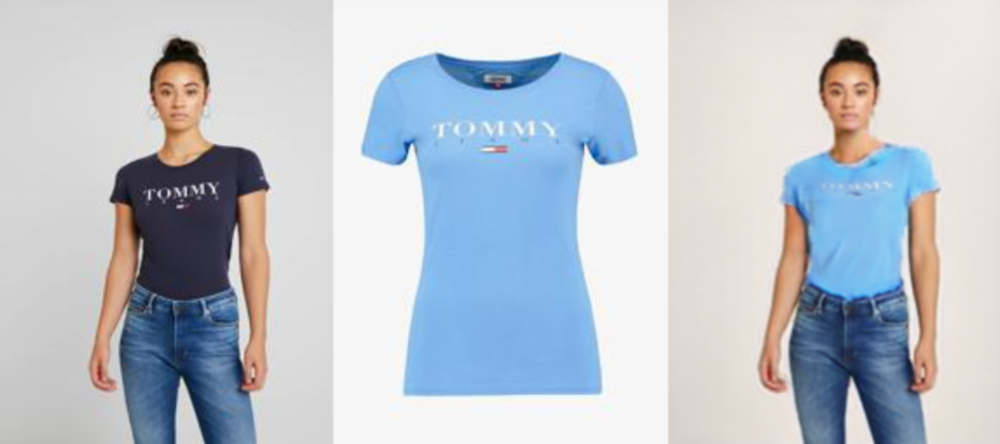
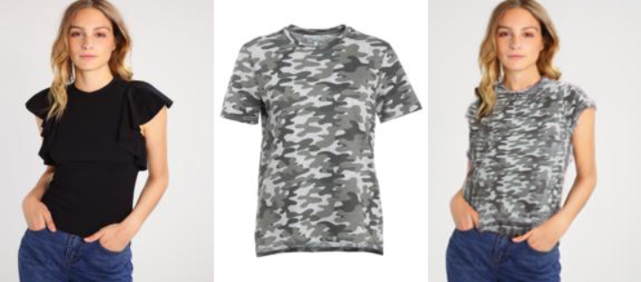
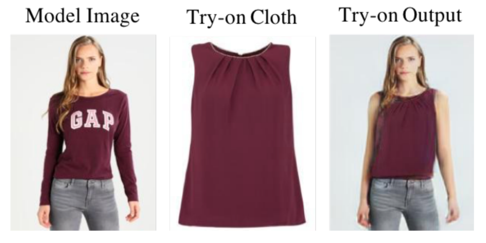

# Team AOI's Project: A virtual try-on platform

## **About Our Project**

We are trying to build an interactive platform which can take a user's photo and give them an output of how they will look in a dress that they are considering. It will be a virtual try on room where you can try different clothes on yourself and see which ones look good on you cause not everything that looks on a model of 6’2’’ will look good on a guy with height of 4’2’’.

## Resources

- Google Colab Notebook For Project: [Click Here](https://colab.research.google.com/drive/15w4ePIf6KikxAHYzz69Alf9lHlz4ustL?usp=sharing)
- Website Platform for Project:  [Click Here](https://colab.research.google.com/drive/15w4ePIf6KikxAHYzz69Alf9lHlz4ustL?usp=sharing)
- Video of website in action: [Click Here](./videoGuides/WebsiteOverview.mp4)
- How to run the Colab Notebook: [Click Here](./videoGuides/HowToRunTheColabNotebook)
- Trial Images: [Click Here](.\trial_Images)

## **Why This Project?**

Due to the ongoing coronavirus pandemic, there is a huge surge in online shopping. Though online shopping of fashion related stuff has grown significantly in the past few years, thanks to players like Myntra, Jabong, etc., still many people hesitate to buy from these online channels due to their concern of “How would that look on me?”. 

**For eg.:** Let's assume that the user is our team member, Sourav Sehgal. Sourav decides to buy clothes for a festival/occasion but he is afraid to buy clothes online as it may not fit or it may not look good because very few things look good on him. Also, he can’t return the once bought cloth and choose another cloth as it may not come on time.
Now, if he has a platform which can display how he will look in chosen clothes it will be very easy for him to decide which clothes to buy and there are chances that it will look good on him.

## **Technical Overview**

We are using the [ACGPN](https://github.com/switchablenorms/DeepFashion_Try_On) algorithm for the Virtual Try-On System. In this algo, we are using a mix of U2 -Net, ResNet, U-net and Human Parser to make a generative model that can swap dresses of people in any pose with the desired cloth. Though for now it has been only trained over top images on female models, so it can only work on that.  
Though our plan was to make a website where a user can send their photo and the cloth photo to see how it looks on them, we faced issues while deploying the model. For the deployment, we first thought of deploying the model on algorithmia.com but due to the sheer size of the model, it was impossible for us to deploy. We thought of making a flask server that would communicate between the frontend website and the algorithmia client. The algorithmia client will take the image URL of the uploaded images that will be exposed by us on a random URL. 

## **Future Plans**

We only have the feature to try a top virtually, but with time we will add the feature to try jeans/lowers and other accessories in our project. This way we will generalize our model. Also we will try to add our model to Flipkart/Amazon and other companies so that it will be embedded in their program. Also, *we had problems deploying problems such as a large model running on GPU on cloud for free, so even though we had the Flask server and frontend ready, we still had to leave it on Google Colab.* 

## Examples

